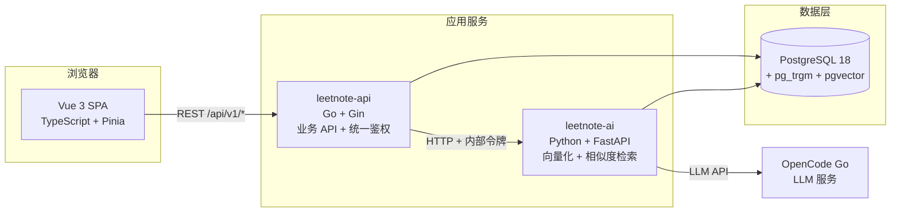

# LeetNote · 算法练习笔记系统

> 一个记录 LeetCode 刷题笔记的个人知识库：Markdown 笔记 + 多解法对比 + 题单检索 + AI 讲解 + 间隔重复复习。
> **Go + Python 双服务**，前后端分离全栈项目。

<p align="left">
  
  
  
  
  
  
</p>

---

## 目录

- [这是什么](#这是什么)
- [功能](#功能)
- [技术栈](#技术栈)
- [系统架构](#系统架构)
- [快速开始](#快速开始)
- [项目结构](#项目结构)
- [工程质量](#工程质量)
- [学习路线](#学习路线)
- [已知限制](#已知限制)
- [文档索引](#文档索引)

---

## 这是什么

刷题最大的问题不是"做不出来"，而是**做完就忘**。笔记散落在各种地方，复习全靠随缘，同一道题错三遍是常态。

LeetNote 想把这件事系统化：

- **记录**：以「题目」为单位组织笔记，一篇笔记下可以挂多个解法对照（暴力 / 优化 / 最优）
- **找回**：按题目、标签、难度、关键词检索；向量检索找出语义相似的笔记
- **理解**：让 LLM 按固定结构点评笔记，跳出自己的思维盲区
- **记住**：用 SM-2 算法安排复习计划，把"做过"变成"会做"

技术上是**一次完整的全栈工程实践**：关系型建模、索引与查询优化、向量检索、多语言服务协作、认证与安全、容器化部署。

---

## 功能

### 📝 笔记管理

| 能力 | 说明 |
|---|---|
| Markdown 笔记 | 支持分屏实时预览、代码块语法高亮 |
| 多解法对照 | 一篇笔记挂多个解法，各自标注语言与时间/空间复杂度 |
| 题目关联 | 笔记可关联到题库中的题目，也可写不绑定题目的专题总结 |
| 标签体系 | 算法 / 数据结构 / 专题三类标签，多对多关联 |
| 草稿与发布 | 草稿状态不出现在默认列表里 |
| 收藏 | 一键收藏，支持「只看收藏」筛选 |

### 🔍 题单与检索

| 能力 | 说明 |
|---|---|
| 灵神题单导入 | 已内置[灵茶山艾府题单](https://github.com/EndlessCheng/codeforces-go/blob/master/leetcode/README.md)：**172 道题 / 27 个专题** |
| 组合筛选 | 关键词 × 难度 × 专题 × 状态 × 收藏，可任意组合 |
| 中文检索 | `pg_trgm` 三元组索引加速的中文子串检索，标题命中优先排序 |
| 跨实体搜索 | 一次搜索同时返回笔记与题目，分组展示 |
| 难度分标注 | 社区统计的难度分（如 1710），比官方三档难度细得多——同为 Medium，1400 分和 2400 分完全不是一个量级 |
| 排序方式 | 6 种：**题单顺序** / 题号 / 按专题 / 难度分升降序 / 标题，均可与筛选组合 |
| 分页与排序 | 分页参数有边界校验，排序字段走白名单（非法值直接 422） |

### 🤖 AI 能力

| 能力 | 说明 |
|---|---|
| 相似题推荐 | 用向量检索找出语义相近的笔记（pgvector + HNSW 索引） |
| AI 笔记点评 | LLM 按「思路 / 关键点 / 复杂度 / 易错点」四段点评，实测能指出笔记里不严谨的地方 |
| 多供应商 | Embedding 与对话模型分开配置，任何 OpenAI 兼容服务都能接 |

> AI 服务由 **OpenCode Go** 订阅驱动（多种开源编码模型），也支持硅基流动 / 智谱 / 通义 / OpenAI。

### 🔁 间隔重复复习（SM-2）

| 能力 | 说明 |
|---|---|
| 闪卡式复习 | **先回忆再显示答案**——主动回忆的效果远好于直接重读 |
| 五档自评 | 完全忘了 → 很轻松，每档都标注了对间隔的影响 |
| 自动排程 | 间隔按 `1 天 → 6 天 → 上次间隔 × 难度系数` 增长，答错重置 |
| 复习压力图 | 未来 7 天的到期分布，避免某天突然堆积 |

### 📊 统计看板

累计刷题量、难度分布、近 30 天趋势、**连续打卡天数**（用 SQL 的 gaps-and-islands 算法计算）。

### 🎨 界面与主题

| 能力 | 说明 |
|---|---|
| 夜间模式 | 浅色 / 深色 / **跟随系统**三档，系统切换时实时响应 |
| 不闪白 | 主题在 `index.html` 的内联脚本里就写好，不会出现"先白一下再变暗" |
| 全套适配 | 自己的界面、Naive UI 组件、ECharts 图表、代码高亮**一起换肤**，不会出现"页面暗了弹窗还白着" |
| 无障碍 | 所有页面的文字对比度都按 WCAG AA 实测过（正文 ≥ 4.5:1）；Lighthouse 无障碍 **1.0** |
| 清晰度 | 暗色不用纯白（纯白配深底会"发光"），正文用 `#e6edf3`，对比度 14.6:1 但柔和不刺眼 |

> 配色全部走 CSS 变量（`styles/main.css`），换肤只切一次 `<html>` 上的类名。
> 组件里不写死任何颜色，所以新增页面自动同时支持亮暗两套。

### 🔐 账号与安全

| 能力 | 说明 |
|---|---|
| JWT 双 Token | access(15min) 存内存 + refresh(7d) 存 httpOnly Cookie，401 自动刷新并重放请求 |
| GitHub OAuth | 支持按已验证邮箱关联已有账号、一键解绑 |
| 密码安全 | bcrypt 哈希、防账号枚举、防时序侧信道 |
| 越权防护 | 所有个人数据查询强制带 `user_id`，越权返回 404 而非 403 |

---

## 技术栈

### 后端主服务 · Go

| 技术 | 版本 | 为什么用它 |
|---|---|---|
| **Go** | 1.27 | 语法极简；goroutine 适合 I/O 密集的 API 服务；编译成单二进制部署最省事 |
| **Gin** | 1.12 | 生态最成熟、资料最多的 Go Web 框架 |
| **pgx** | 5.11 | PostgreSQL 高性能驱动，支持连接池与批量查询 |
| **golang-jwt** | 5.3 | JWT 签发与校验 |
| **validator** | 10.30 | 请求参数校验（含自定义规则） |
| `log/slog` | 标准库 | 结构化日志，零依赖 |

> **为什么主服务不选 Java**：Java 技术栈的学习成本（JVM + 并发 + Spring 全家桶）约是 Go 的 3～4 倍，
> 而 Go 岗位集中在大厂与云原生方向，质量高、避开红海。把省下的时间投在算法与系统设计上更划算。

### AI 服务 · Python

| 技术 | 版本 | 为什么用它 |
|---|---|---|
| **Python** | 3.11 | AI 生态的唯一选择 |
| **FastAPI** | 0.141 | 异步、Pydantic 校验、自动生成 OpenAPI 文档 |
| **psycopg 3** | 3.3 | PostgreSQL 异步驱动（含连接池） |
| **httpx** | 0.28 | 异步 HTTP 客户端，调用 LLM API |
| **NumPy** | 2.4 | 本地兜底向量器的向量运算 |

> **为什么 AI 服务不用 Go**：向量库客户端、LLM SDK、数据处理生态几乎全在 Python。
> 强行统一语言会事倍功半——**双语言是工程判断，不是炫技**。

### 数据库

| 技术 | 版本 | 用来做什么 |
|---|---|---|
| **PostgreSQL** | 18.6 | 主数据库，11 张表 |
| **pg_trgm** | 内置 | 中文子串检索的 GIN 三元组索引 |
| **pgvector** | 0.8.6 | 向量存储与相似度检索（HNSW 索引） |
| **pgcrypto** | 内置 | `gen_random_uuid()` |

### 前端

| 技术 | 版本 | 为什么用它 |
|---|---|---|
| **Vue 3** | 3.5 | 组合式 API + `<script setup>` 写起来最简洁 |
| **TypeScript** | 5.9 | 类型安全是硬门槛，也是重构的信心来源 |
| **Vite** | 8.3 | 秒级冷启动 |
| **Pinia** | 4.0 | Vue 官方状态管理 |
| **Vue Router** | 5.3 | 路由与登录守卫 |
| **Naive UI** | 2.45 | 组件库，TypeScript 支持极好 |
| **markdown-it** | 15 | Markdown 渲染（关闭原始 HTML 防 XSS） |
| **highlight.js** | 11 | 代码高亮（**按需注册语言**，产物 1MB → 174KB） |
| **ECharts** | 6.1 | 统计图表（按需引入图表类型） |

> **代码高亮为什么不用官方主题**：`github.css` / `github-dark.css` 都是全局规则，
> 没法按"当前是亮色还是暗色"切换——两个都引入的话后一个会永远生效。
> 所以用 CSS 变量手写了一份配色，顺便和整体色调统一。

### 工程化

| 用途 | 选型 |
|---|---|
| 数据库迁移 | golang-migrate（版本化 SQL） |
| 测试 | Go `testing` + `httptest`；Python `pytest` + `pytest-asyncio` |
| 代码规范 | `gofmt` / `go vet` / `vue-tsc` |
| 版本控制 | Git + GitHub（SSH over 443，免代理直连） |

---

## 系统架构



### 职责边界

| 服务 | 负责 | 不负责 |
|---|---|---|
| `leetnote-api`（Go） | 业务数据、**统一用户鉴权** | 不做向量计算 |
| `leetnote-ai`（Python） | 向量化、相似度检索、LLM 调用 | **不做用户认证** |

**前端不直接访问 AI 服务。** Go 侧统一鉴权后转发，Python 用 `X-Internal-Token` 拒绝外部请求——
用户认证只实现一次，AI 服务也不必暴露到公网。

---

## 快速开始

### 前置要求

| 组件 | 版本 |
|---|---|
| Go | ≥ 1.24 |
| Python | ≥ 3.11（**注意：不要用 Anaconda 的，见下方说明**） |
| Node.js | ≥ 20 |
| PostgreSQL | ≥ 16（需支持 pgvector） |

### 1. 数据库

```bash
createdb leetnote
psql -d leetnote -f leetnote-api/migrations/000001_init.up.sql
# 用超级用户创建向量扩展（普通用户会 permission denied）
psql -U postgres -d leetnote -c "CREATE EXTENSION IF NOT EXISTS vector;"
psql -d leetnote -f leetnote-api/migrations/000002_pgvector.up.sql
psql -d leetnote -f leetnote-api/migrations/000003_case_insensitive_identity.up.sql
psql -d leetnote -f leetnote-api/migrations/000004_oauth_github.up.sql
psql -d leetnote -f leetnote-api/migrations/000005_problem_tags.up.sql
```

### 2. 后端（Go）

```bash
cd leetnote-api
cp .env.example .env          # 按需修改 DATABASE_URL / JWT_SECRET
go mod tidy
go run ./cmd/server           # :8080
curl http://localhost:8080/health
```

### 3. AI 服务（Python，可选）

> 不启动也能用——只是「相似题推荐」和「AI 讲解」不可用。

```bash
cd leetnote-ai
python -m venv .venv          # 务必用官方 Python，别用 Anaconda
.venv/Scripts/pip install fastapi "uvicorn[standard]" pydantic-settings \
    "psycopg[binary,pool]" httpx numpy
cp .env.example .env          # 填 CHAT_API_KEY 才能用 LLM 功能
.venv/Scripts/python run.py   # :8000（必须用 run.py，见 docs/ENVIRONMENT.md）
```

### 4. 前端

```bash
cd frontend
npm install
cp .env.example .env
npm run dev                   # :5173
```

打开 <http://localhost:5173> 注册账号即可。

### 导入灵神题单（可选）

```bash
cd leetnote-api
go run ./cmd/importer -file lingshen-tidan.md -dry-run   # 先干跑看统计
go run ./cmd/importer -file lingshen-tidan.md            # 正式导入
```

导入工具是**幂等**的（重复执行只会更新，不会产生重复数据），并且会顺带补齐三样题单里没有的信息：

| 补齐内容 | 来源 | 说明 |
|---|---|---|
| 官方难度 | LeetCode GraphQL | 题单只给中文标题和 slug，没有 Easy/Medium/Hard |
| **难度分** | [`zerotrac/leetcode_problem_rating`](https://github.com/zerotrac/leetcode_problem_rating) | 按竞赛表现统计的分数，灵神的「难度练习」插件用的也是这份数据 |
| 跳转链接 | 由 slug 拼出 | `https://leetcode.cn/problems/<slug>/` |

> **关于难度分的覆盖率**：这份数据是从**竞赛**表现反推的，而 LeetCode 竞赛从 2018 年
> （约 700 多题）才开始，所以早期经典题（1. 两数之和、15. 三数之和、42. 接雨水）
> **没有分数**。实测题单里覆盖约 42%（73/172），缺的全部是竞赛时代之前的老题。
> 这是数据源本身的边界，不是 bug —— 前端对无数据的题显示「—」。

网络不通时（GitHub 被墙、公司代理），可以自己下载一份再传进去：

```bash
go run ./cmd/importer -file lingshen-tidan.md -ratings-file D:\dev\_downloads\ratings.txt
```

---

## 项目结构

```
leetnote/
├── leetnote-api/                    # Go 主服务
│   ├── cmd/
│   │   ├── server/                  #   入口：装配依赖 + 优雅关闭
│   │   └── importer/                #   题单导入 CLI（幂等）
│   ├── internal/
│   │   ├── config/                  #   环境变量 → 结构体
│   │   ├── logging/                 #   slog 结构化日志
│   │   ├── db/                      #   连接池 + 事务包装
│   │   ├── model/                   #   领域模型
│   │   ├── repository/              #   数据访问（Querier 抽象，可复用事务）
│   │   ├── service/                 #   业务逻辑（SM-2 算法在这里）
│   │   ├── handler/                 #   HTTP 处理层
│   │   ├── middleware/              #   RequestID / Logger / Recovery / CORS / Auth
│   │   ├── router/                  #   路由与依赖装配
│   │   ├── validator/               #   参数校验 + 字段级错误
│   │   ├── ai/                      #   leetnote-ai 的 HTTP 客户端
│   │   ├── oauth/                   #   GitHub OAuth 客户端
│   │   └── pkg/                     #   errs / jwt / hash / response
│   └── migrations/                  # 5 个版本化 SQL 迁移
│
├── leetnote-ai/                     # Python AI 服务
│   ├── run.py                       #   入口（事件循环适配，见文档）
│   ├── app/
│   │   ├── embedding/               #   向量器（远程模型 / 本地兜底）
│   │   ├── llm/                     #   对话客户端 + prompt 模板
│   │   ├── repository.py            #   向量与检索相关读写
│   │   └── api/v1/                  #   embed / similar / explain
│   └── tests/                       # 22 个单测
│
├── frontend/                        # Vue 3 前端
│   ├── src/
│   │   ├── api/                     #   axios 实例 + 各领域 API
│   │   ├── stores/                  #   Pinia
│   │   ├── router/                  #   路由 + 登录守卫
│   │   ├── views/                   #   8 个页面
│   │   ├── components/              #   笔记卡片 / Markdown / 图表等
│   │   └── utils/                   #   Markdown 渲染 / 格式化
│   └── ...
│
└── docs/
    ├── DESIGN.md                    # 完整设计方案（数据库、API 契约、架构）
    ├── ROADMAP.md                   # 12 个月求职学习路线（逐周）
    └── ENVIRONMENT.md               # 环境搭建与踩坑记录
```

**代码规模**：约 16,200 行（非空行）—— Go 9,384 行（90 文件）· 前端 5,468 行（42 文件）· Python 1,364 行（24 文件）

---

## 工程质量

### 测试

| 范围 | 覆盖情况 |
|---|---|
| Go 集成测试（`internal/router`） | **99.8%** —— 覆盖 HTTP → service → repository 全链路（真实数据库） |
| Go 基础包（errs / hash / jwt / response） | 87.8% ~ 93.3% |
| Go AI 客户端 | 75.4%（`httptest` 模拟外部服务） |
| SM-2 算法 | 7 个单测覆盖间隔递增、答错重置、难度系数保留与下限、评分阈值、脏数据回退 |
| 题单解析器 | 覆盖专题向下继承、去重、课后作业识别、格式变化防护、**顺序号与链接生成** |
| 难度分解析器 | 9 个单测覆盖表头跳过、**BOM 处理**（否则整份文件解析失败）、单条脏数据跳过、空内容与格式变化防护、镜像回退 |
| Python | 22 个单测（向量器性质、LLM 客户端头部要求与重试策略） |

### 无障碍与视觉质量

| 检查项 | 结果 |
|---|---|
| Lighthouse 无障碍 | **1.0**（9 个页面 × 亮/暗两套主题，全部零失败项） |
| 文字对比度 | 全部满足 WCAG AA（正文 ≥ 4.5:1、大号文字 ≥ 3:1），逐元素实测 |
| 表单可访问名称 | 所有输入/选择控件都有 `aria-label`，屏幕阅读器不会念成"输入框" |
| 键盘导航 | 焦点环只在键盘操作时出现（`:focus-visible`），鼠标点击不打扰 |

> 顺带修掉了 Naive UI 默认配色里的几处不达标：占位符 1.8:1、标签文字 1.9:1、
> 空状态提示 1.8:1、头像白字压浅灰 1.6:1。这些在浅色主题下"看着还行"，
> 但对低视力用户基本等于看不见。

### 接口与数据

- **40 个路由**（3 个探针 + 37 个业务接口）
- **11 张表**，6 个版本化迁移
- **172 道题 / 27 个专题**已导入，全部带 LeetCode 跳转链接，其中 73 道带社区难度分

### 值得一提的技术点

| 点 | 说明 |
|---|---|
| **防越权** | 所有个人数据查询强制带 `user_id`；越权返回 404 而非 403（403 会泄漏「资源存在」） |
| **防 N+1** | 列表页用批量查询补齐关联数据，固定 3 次查询与条数无关 |
| **中文检索** | `pg_trgm` + GIN 索引，并转义 LIKE 通配符（搜 `100%` 不会命中全部） |
| **连续打卡** | 用 gaps-and-islands（日期减行号）在 SQL 里算，不用应用层循环 |
| **向量检索** | 只比较同模型产生的向量（不同模型的向量不在同一空间）；按 `user_id` 隔离 |
| **异步副作用** | 保存笔记后异步生成向量与复习卡，不阻塞用户；用独立 context 避免请求结束即取消 |
| **外部数据不覆盖本地** | 导入时难度分写 `COALESCE(EXCLUDED.rating, problems.rating)`、难度用「占位值不覆盖已有值」——CDN 超时或断网重跑时，库里已有的正确数据一条都不会变差 |
| **排序必须有 tiebreaker** | 每种排序都补 `id` 兜底；缺了它等值行顺序不确定，翻页会出现重复行 |
| **测试不能只删用户** | `problems`/`tags` 是全局表，不随用户级联删除。集成测试曾经只清理测试用户，导致每跑一次就往题目库里塞一条重复的「Two Sum」 |
| **换肤只切一个类名** | 颜色全走 CSS 变量，`<html>` 上加一个 `.dark` 就完成整站换肤；组件里零硬编码颜色 |
| **暗色不用纯白** | 纯白配深底会"发光"，正文用 `#e6edf3`（14.6:1）——对比度足够但柔和不刺眼 |
| **主色分两个 token** | `--ln-primary` 给按钮底色，`--ln-primary-text` 给文字。同一个蓝色当文字放在浅色底上只有 4.05:1，不达标 |
| **推理模型陷阱** | 推理模型会先输出一大段 reasoning，`max_tokens` 太小会把正文挤成空字符串 |
| **前端 401 自动刷新** | 单飞（并发只刷一次）+ 独立 axios 实例（避免递归） |

### 踩坑记录

开发过程中遇到并记录下来的问题（详见 `docs/ENVIRONMENT.md` 与各 README）：

- **Vue 模板组件漏导入不会报错** —— 未解析的 kebab-case 组件被当成自定义元素，`vue-tsc` 和 `vite build` 都放过，只在浏览器控制台警告
- **Windows 上 psycopg3 异步不可用** —— `ProactorEventLoop` 缺 `add_reader/writer`，且 uvicorn 把 Proactor 硬编码进了 loop factory
- **Anaconda 的 Python 无法发 HTTPS** —— 配了不兼容的 OpenSSL，表现为「pip 找不到任何包」
- **`omitempty` 的零值陷阱** —— 数值类型的 0 会被跳过校验，`?days=0` 绕过了 `min=1`
- **Vue Router 复用组件实例** —— 只有路由参数变化时 `onMounted` 不会再触发
- **集成测试往全局表塞脏数据** —— 清理只删了测试用户，而 `problems`/`tags` 不随用户级联删除；每跑一次测试就在题目库里留一条重复的「Two Sum」
- **难度分数据有时代边界** —— 它是从竞赛表现反推的，LeetCode 竞赛 2018 年才开始（约 700 多题），早期经典题天然没有分数
- **Naive 的 `n-form-item` 标签没有 `for`** —— 渲染出来的 `<label>` 和输入框之间没有程序化关联，屏幕阅读器读不出名称，必须自己补 `aria-label`
- **`n-input` 的 `aria-label` 落错地方** —— Naive 会把未知属性透传到外层 div，而不是内层 `<input>`；要用 `:input-props="{ 'aria-label': ... }"` 才生效
- **暗色主题对象有 65KB** —— Naive 的 `darkTheme` 覆盖全库组件、无法 tree-shaking，这是换全库暗色适配的固定代价

---

## 学习路线

如果打算照着做一个类似的**全栈求职项目**，建议按下面的顺序推进。
核心原则：**每一步都立刻用到项目里**，不做与项目无关的纯理论学习。

### 阶段一 · 地基（约 4 周）

| 周 | 内容 | 产出 |
|---|---|---|
| 1 | **SQL 基础**：关系模型、主键外键、`SELECT`/`JOIN`/`GROUP BY` | 用 LeetCode 数据库题库练 30 道 |
| 2 | **SQL 进阶**：索引原理、`EXPLAIN`、事务与隔离级别 | 能解释「加了索引为什么变快」 |
| 3 | **Go 语言基础**：语法、slice/map、struct/interface、错误处理 | 能读懂并改写简单的 Go 程序 |
| 4 | **Go 并发**：goroutine、channel、context、sync | 能手写一个 worker pool |

> 这一阶段**数据库优先**。后端面试里数据库的权重远高于框架，而且是本项目最能体现深度的地方。

### 阶段二 · 后端服务（约 5 周）

| 周 | 内容 | 产出 |
|---|---|---|
| 5 | **Web 框架**：Gin 路由、中间件、参数绑定与校验 | 项目骨架能跑起来 |
| 6 | **分层架构**：handler → service → repository，依赖注入 | 理解为什么不能让 handler 直接写 SQL |
| 7 | **认证**：bcrypt、JWT 双 Token、中间件鉴权 | 注册登录能跑通 |
| 8 | **工程能力**：统一错误处理、结构化日志、优雅关闭、`httptest` | 有测试、有日志、有超时 |
| 9 | **复杂查询**：事务、批量查询消除 N+1、动态 SQL 与白名单 | 核心 CRUD 接口完成 |

> 重点体会：**越权防护**（强制带 `user_id`）、**防 N+1**、**事务边界**——这三个是后端面试的高频追问点。

### 阶段三 · 前端（约 4 周）

| 周 | 内容 | 产出 |
|---|---|---|
| 10 | **Vue 3 组合式 API** + TypeScript 基础 | 能读懂 `<script setup>` |
| 11 | **路由与状态**：Vue Router 守卫、Pinia | 登录守卫 + 用户状态 |
| 12 | **HTTP 层**：axios 拦截器、401 自动刷新、错误统一处理 | 会话自动续期 |
| 13 | **业务页面**：列表筛选分页、Markdown 编辑与渲染 | 完整可用的界面 |

> 前端的重点是**把后端能力正确地用起来**，不要在 UI 细节上过度投入。

### 阶段四 · 差异化能力（约 5 周）

| 周 | 内容 | 产出 |
|---|---|---|
| 14 | **向量检索**：pgvector 建模、HNSW 索引、余弦相似度 | 相似题推荐 |
| 15 | **Embedding 抽象**：定义协议、远程模型与本地兜底两条实现 | 无 API Key 也能跑通 |
| 16 | **LLM 集成**：对话客户端、prompt 设计、重试与错误处理 | AI 笔记点评 |
| 17 | **算法落地**：SM-2 间隔重复（优先写成纯函数，便于穷尽边界） | 复习功能 |
| 18 | **数据可视化**：ECharts 按需引入、SQL 聚合与日期补齐 | 统计看板 |

> 这一阶段是**简历差异化的来源**。大多数人的项目止步于 CRUD，能讲清「向量检索怎么做、LLM 输出怎么保证可用、算法怎么测」的人少得多。

### 阶段五 · 收尾（约 3 周）

| 周 | 内容 |
|---|---|
| 19 | **容器化**：Dockerfile 多阶段构建、docker-compose 编排 |
| 20 | **部署上线**：前端 Vercel/Cloudflare Pages、后端 Render/Zeabur、数据库 Neon/Supabase |
| 21 | **CI/CD**：GitHub Actions 跑 lint → test → build → deploy |
| 22 | **文档与复盘**：README、架构图、把踩坑整理成能讲的故事 |

### 面试前必须能讲清楚的问题

**数据库**
- 为什么 `problems` 表要独立出来而不是每个用户存一份？
- 部分唯一索引 `WHERE problem_id IS NOT NULL` 解决了什么问题？
- 什么情况下索引会失效？联合索引的最左前缀原则是什么？
- 事务的四个隔离级别分别解决什么问题？MVCC 怎么实现？
- HNSW 索引和精确检索的区别？为什么向量检索用近似算法？

**后端**
- JWT 无状态，「登出」怎么实现？
- 什么是 N+1 查询？怎么发现、怎么解决？
- 服务间为什么用 HTTP 而不是 gRPC？什么情况下该换成 gRPC？
- 越权访问该返回 404 还是 403？为什么？
- 异步副作用（生成向量、建复习卡）失败了怎么办？生产环境该怎么改进？

**前端**
- `ref` 和 `reactive` 的区别？为什么用 Proxy 实现响应式？
- 401 自动刷新时，为什么不能每个请求各自去刷新？
- 路由参数变化时组件会重新挂载吗？不会的话怎么处理？

**AI 工程**
- RAG 的完整链路？怎么评估检索质量？
- 推理模型为什么要给更大的 `max_tokens`？
- 向量维度变化时要改哪些地方？

---

## 已知限制

诚实列出当前实现的边界，也是后续可改进的方向：

| 限制 | 说明 |
|---|---|
| **服务间通信用 HTTP 而非 gRPC** | 数据量下 HTTP 完全够用；`.proto` 契约已在 `DESIGN.md` 写好，将来可直接替换 |
| **AI 调用是同步的** | `POST /notes/:id/explain` 要等 10s+，为此把 `WriteTimeout` 放宽到了 120s。生产环境应改成异步任务 + 轮询 |
| **异步副作用用 goroutine** | 生成向量/复习卡失败只记日志、不重试。生产环境应换成消息队列 |
| **没有 Redis** | 未做缓存与接口限流 |
| **中文检索是子串匹配** | `pg_trgm` 不切词，语义检索靠向量层补齐 |
| **集成测试跑在开发库上** | 早期曾把测试数据遗留在开发库里；正确做法是独立测试库或用事务回滚 |
| **单机部署** | 没有做多实例的水平扩展 |

---

## 文档索引

| 文档 | 内容 |
|---|---|
| [`docs/DESIGN.md`](docs/DESIGN.md) | 完整设计方案：11 张表的 DDL 与设计决策、40 个接口契约、gRPC 契约、架构说明 |
| [`docs/ROADMAP.md`](docs/ROADMAP.md) | **12 个月求职学习路线**：逐周任务、里程碑验收、风险应对 |
| [`docs/ENVIRONMENT.md`](docs/ENVIRONMENT.md) | 环境搭建全过程与踩坑记录（Go / PostgreSQL / pgvector / Python） |
| [`leetnote-api/README.md`](leetnote-api/README.md) | Go 服务说明、常用命令、目录结构 |
| [`leetnote-ai/README.md`](leetnote-ai/README.md) | AI 服务说明、Embedding 与 LLM 配置、三个已知问题 |
| [`frontend/README.md`](frontend/README.md) | 前端说明、认证机制、目录结构 |

---

<p align="center">
  <sub>用 LeetNote 记录 LeetNote 的开发过程 —— 边做边记录，项目完成时笔记也完成了。</sub>
</p>
